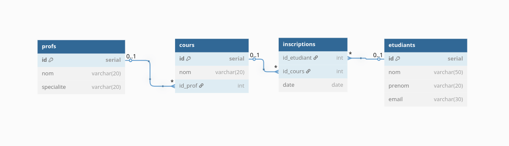

# 📘 Corrigé de l'Examen intermédiaire InfraDon1

## Exercice 1 - Diagramme UML (15 points)



## Exercice 2 – Requêtes SQL (20 points)

### 1. Sélectionner tous les étudiants inscrits à un cours

```sql
SELECT e.*
FROM etudiants e
JOIN inscriptions i ON e.id = i.id_etudiant;
```

### 2. Afficher la liste des cours avec le nom du professeur

```sql
SELECT c.nom AS nom_cours, p.nom AS nom_prof
FROM cours c
JOIN profs p ON c.id_prof = p.id;
```

### 3. Afficher le nombre d’étudiants inscrits par cours

```sql
SELECT c.nom AS nom_cours, COUNT(i.id_etudiant) AS nb_inscrits
FROM cours c
LEFT JOIN inscriptions i ON c.id = i.id_cours
GROUP BY c.nom;
```

### 4. Lister les étudiants non inscrits à un cours

```sql
SELECT *
FROM etudiants
WHERE id NOT IN (
    SELECT id_etudiant FROM inscriptions
);
```

### 5. Supprimer les inscriptions datant d’avant 2022

```sql
DELETE FROM inscriptions
WHERE date < '2022-01-01';
```

### 6. Mettre à jour le nom du cours "Maths" en "Mathématiques"

```sql
UPDATE cours
SET nom = 'Mathématiques'
WHERE nom = 'Maths';
```

### 7. Trier les cours par nombre d’inscrits décroissant

```sql
SELECT c.nom AS nom_cours, COUNT(i.id_etudiant) AS nb_inscrits
FROM cours c
LEFT JOIN inscriptions i ON c.id = i.id_cours
GROUP BY c.nom
ORDER BY nb_inscrits DESC;
```

### 8. Créer un index sur la colonne date de la table inscriptions

```sql
CREATE INDEX idx_inscriptions_date ON inscriptions(date);
```

---

## Exercice 3 – Normalisation (10 points)

Table de départ :  
`nom_etudiant | email | nom_cours | nom_prof | date`

### 1. Anomalies possibles :

-   **Insertion** : impossible d’ajouter un nouveau prof sans cours ou étudiant
-   **Mise à jour** : modification du nom d’un cours peut affecter plusieurs lignes
-   **Suppression** : supprimer un étudiant supprime son cours si non séparé

### 2. Décomposition en 3NF :

-   Table `etudiants(id, nom, email)`
-   Table `profs(id, nom)`
-   Table `cours(id, nom, id_prof)`
-   Table `inscriptions(id_etudiant, id_cours, date)`

---

## Exercice 4 – Jointures & Agrégations (24 points)

### 1. Lister les cours avec le nombre d'étudiants inscrits

```sql
SELECT c.nom, COUNT(i.id_etudiant) AS nb_inscrits
FROM cours c
LEFT JOIN inscriptions i ON c.id = i.id_cours
GROUP BY c.nom;
```

### 2. Afficher le nom des professeurs avec le total d'inscriptions dans leurs cours

```sql
SELECT p.nom, COUNT(i.id_etudiant) AS total_inscriptions
FROM profs p
JOIN cours c ON p.id = c.id_prof
LEFT JOIN inscriptions i ON c.id = i.id_cours
GROUP BY p.nom;
```

### 3. Lister les étudiants n’ayant pas de cours

```sql
SELECT e.*
FROM etudiants e
LEFT JOIN inscriptions i ON e.id = i.id_etudiant
WHERE i.id_etudiant IS NULL;
```

### 4. Trouver les cours les plus populaires

```sql
SELECT c.nom, COUNT(i.id_etudiant) AS nb_inscrits
FROM cours c
JOIN inscriptions i ON c.id = i.id_cours
GROUP BY c.nom
ORDER BY nb_inscrits DESC
LIMIT 1; -- facultatif
```

---

## 📝 Exercice 5 – QCM Vrai / Faux (20 points)

| Affirmation                                           | Réponse | Justification                 |
| ----------------------------------------------------- | ------- | ----------------------------- |
| 1. OLTP est optimisé pour SELECT lourds               | ❌ Faux | C’est OLAP, pas OLTP          |
| 2. OLAP = SELECT complexes sur gros volumes           | ✅ Vrai |                               |
| 3. Un index améliore INSERT                           | ❌ Faux | Il le ralentit légèrement     |
| 4. Ordre des colonnes sans importance (index composé) | ❌ Faux | L’ordre influence les filtres |
| 5. Base normalisée = moins de redondance              | ✅ Vrai |                               |
| 6. SQL manipule données & structure                   | ✅ Vrai |                               |
| 7. DML = INSERT, SELECT, UPDATE, DELETE               | ✅ Vrai |                               |
| 8. 1NF = une seule valeur par cellule                 | ✅ Vrai |                               |
| 9. Plusieurs lectures en parallèle sont sûres         | ✅ Vrai |                               |
| 10. Procédures stockées = automatisation SQL          | ✅ Vrai |                               |

---

## Exercice 6 – Questions ouvertes (15 points)

### 1. Explique le principe de normalisation

Réduction de la redondance et amélioration de la cohérence des données via la séparation des entités en plusieurs tables reliées.

### 2. Quand utiliser une base OLAP ?

Pour les analyses décisionnelles. Exemple : entreprise analysant les ventes annuelles par région.

### 3. Contraintes d’intégrité

-   **Clé primaire** : assure unicité d’une ligne (`id`).
-   **Clé étrangère** : garantit cohérence entre tables (`id_prof`).
-   **NOT NULL** : empêche les valeurs manquantes.

---
