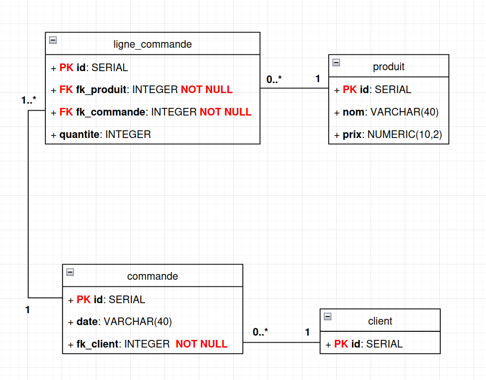

# 📘 Révisions – Infrastructure des données (Avril 2025)

---

✍️ **L'examen se déroule sur papier** : aucune exécution de requête SQL ne sera possible. Il s'agit d'évaluer votre **compréhension théorique** et votre **capacité à analyser des situations**.

---

### 📝 Exercice 1 – Client / Commande

#### 🔹 Modèle UML

[](UML.png)

---

### 📝 Exercice 2 – Requêtes SQL

1. Sélectionner tous les employés.

```sql
SELECT * FROM employes;
```

2. Lister les employés embauchés après 2022.

```sql
SELECT *
FROM employes
WHERE date_embauche > '2022-12-31';
```

3. Afficher le salaire moyen des développeurs.

```sql
SELECT AVG(salaire)
FROM employes
WHERE poste = 'développeur';
```

4. Trier les employés par salaire décroissant.

```sql
SELECT *
FROM employes
ORDER BY salaire DESC;
```

5.

```sql
DELETE FROM employes
WHERE poste = 'stagiaire';
```

---

### 📝 Exercice 3 – Détection d’anomalies

**Anomalies potentielles** :

-   Insertion : impossible d’ajouter un nouveau client sans commande
-   Mise à jour : changement du nom du client = modification sur plusieurs lignes
-   Suppression : supprimer une ligne = perte d’infos sur le client ou le produit

**Décomposition en 3NF** :

1. `Clients(client_id, nom, ville)`
2. `Produits(produit_id, nom, prix)`
3. `Commandes(commande_id, client_id)`
4. `LignesCommandes(commande_id, produit_id, quantite)`

---

### 📝 Exercice 4 – Jointures & Agrégats

1. Lister tous les clients avec leurs commandes (même ceux sans commande).

```sql
SELECT c.nom, co.id, co.date
FROM clients c
LEFT JOIN commandes co ON c.id = co.client_id;
```

2. Afficher le total de produits commandés par client.

```sql
SELECT c.nom, SUM(lc.quantite) AS total_produits
FROM clients c
JOIN commandes co ON c.id = co.client_id
JOIN lignes_commandes lc ON co.id = lc.commande_id
GROUP BY c.nom;
```

3. Lister les produits les plus commandés (quantité totale).

```sql
SELECT produit, SUM(quantite) AS total
FROM lignes_commandes
GROUP BY produit
ORDER BY total DESC;
```

---

### ❓ QCM Vrai / Faux

1. Un index permet d'accélérer les requêtes de type SELECT.
   ✔️ Vrai
   👉 Les index fonctionnent comme des tables de correspondance : ils permettent à PostgreSQL de retrouver plus rapidement les lignes correspondant à une condition (ex : WHERE, JOIN, ORDER BY, etc.). C’est comme un sommaire dans un livre.

2. Un index est automatiquement créé sur une colonne PRIMARY KEY.
   ✔️ Vrai
   👉 En PostgreSQL (et dans la majorité des SGBD), dès qu’on définit une colonne comme PRIMARY KEY, un index est automatiquement créé dessus pour garantir l’unicité et accélérer les recherches.

3. Un index rend toujours toutes les requêtes plus rapides.
   ❌ Faux
   👉 Un index est utile pour lire plus vite (SELECT), mais il peut ralentir les opérations d’écriture (INSERT, UPDATE, DELETE), car l’index doit être mis à jour à chaque changement de données.
   De plus, certains types de requêtes (ex : agrégats sans filtre, table entière lue) ne bénéficient pas forcément d’un index.

4. Les index ralentissent les opérations d’insertion (INSERT).
   ✔️ Vrai
   👉 Chaque fois qu’on insère une nouvelle ligne, PostgreSQL doit mettre à jour tous les index concernés. Plus on a d’index, plus ces opérations d'insertion et modifications prennent du temps.

5. Un index de type GIN est adapté à la recherche en texte intégral.
   ✔️ Vrai
   👉 L’index GIN (Generalized Inverted Index) est conçu pour les structures complexes comme tsvector, utilisé dans les recherches plein texte (to_tsvector, to_tsquery, etc.).

6. Le type d’index par défaut dans PostgreSQL est Hash.
   ❌ Faux
   👉 Le type par défaut est BTree (arbre équilibré), utilisé pour les recherches d’égalité, d’intervalles, les tris (ORDER BY), etc.
   Les index Hash existent, mais sont peu utilisés et ont des cas très spécifiques (uniquement égalité, pas d'ordre).

7. On peut avoir plusieurs index sur une même table.
   ✔️ Vrai
   👉 Il est tout à fait possible (et courant) d’avoir plusieurs index sur une table, chacun répondant à un besoin différent (recherche rapide sur différentes colonnes, contraintes, tri, etc.).

---

### 🧠 Questions ouvertes

8.  Donne une définition simple d’un index.
    Un index est une structure de données (comme un dictionnaire ou un sommaire) utilisée par le SGBD pour accélérer l'accès aux lignes d'une table.
    Il permet de retrouver rapidement les enregistrements répondant à une condition, sans devoir lire toute la table.

9.  Dans quels cas est-il pertinent de créer un index ?
    Il est pertinent de créer un index quand une colonne est souvent utilisée pour :

    -   ✅ Filtrer les résultats dans une clause WHERE

    -   ✅ Faire des jointures entre plusieurs tables

    -   ✅ Bonus : Sur des colonnes utilisées dans ORDER BY ou GROUP BY, si la table est volumineuse.

10. Cite deux inconvénients à l’utilisation d’index.

    ❗ **Ralentissement des écritures**

    À chaque INSERT, UPDATE ou DELETE, les index doivent être mis à jour → cela alourdit les performances.

    🧠 **Consommation d’espace disque**

    Chaque index est une structure supplémentaire stockée sur le disque → une table avec beaucoup d’index peut devenir très lourde.

---

### 💡 Étude de cas – Table `produits(id, nom, description, prix)`

**a. Colonnes à indexer :**

-   `nom`
-   `prix`

**b. Type d’index pour recherche plein texte sur `description` :**

```sql
CREATE INDEX idx_description_gin
ON produits USING GIN(to_tsvector('french', description));
```

**c. Pourquoi ne pas indexer toutes les colonnes ?**
Indexer toutes les colonnes consomme des ressources et ralentit les écritures. Il faut indexer uniquement les colonnes utiles pour les recherches.
